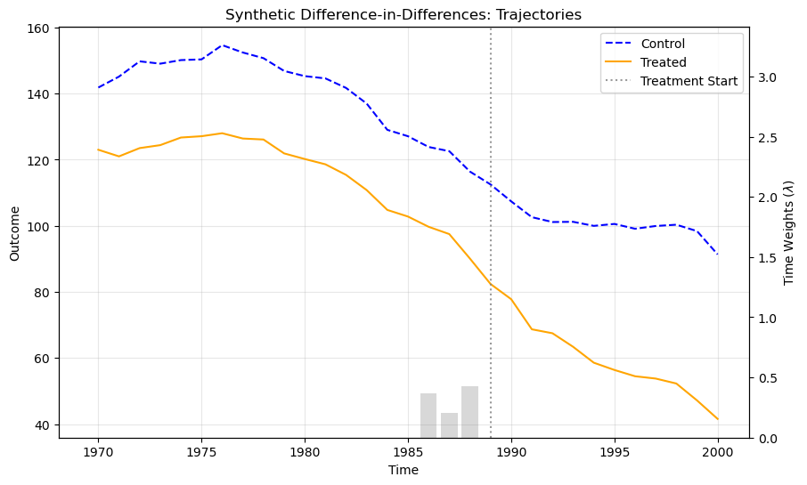
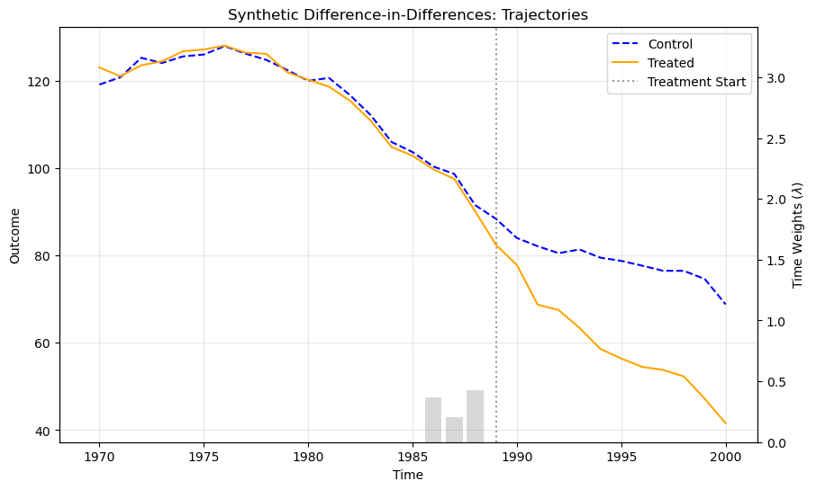

# SyntheticDID

`SyntheticDID` is a Python implementation of the **Synthetic Difference-in-Differences (SDID)** estimator. 

> [!NOTE]
> This package is still under development. Issues and PR are welcomed.
> A link to PyPI will be put here in the future.

### Introduction

While other implementations in Python like `pysynthdid` exist, this package has (aims to have) several advantages:

* **Time-Varying Covariates**: Support for including dynamic controls in estimation.
* **Support for Staggered Adoption** (multiple treatment timing).
* **More Robust ATT Estimation**: Uses the weighted two-way fixed-effect regression to estimate the Average Treatment Effect on the Treated (ATT), while also keeping the ATT estimated by diff-in-diff. 
*  **More Accurate Inference**: Fixes bugs existing in other previous implementations.
* **Relaxed Dependencies**: Updated to be compatible with the latest Python data science stack.
* **Other Features (under construction)**: 
    * Added more modern variants of SDID.
    * Enhanced support for **Event Studies**.


### Next Step

* Support for relaxation approach (forcing a more even estimation of omega)
* Support for event studies (estimation of dynamic effects)


### References & Resources

**Original Paper**
Arkhangelsky, D., Imbens, G. W., Lei, L., & Hirshberg, D. A. (2021). Synthetic Difference-in-Differences. American Economic Review. https://www.aeaweb.org/articles?id=10.1257/aer.20190159

**Related Paper**
* SDID: https://docs.iza.org/dp15907.pdf
* Covariates: https://github.com/skranz/xsynthdid/blob/main/paper/synthdid_with_covariates.pdf
* SDID event: https://arxiv.org/abs/2407.09565

**Other Implementations**
* R: https://synth-inference.github.io/synthdid/
* Stata: https://github.com/Daniel-Pailanir/sdid 
* Python (pysynthdid): https://github.com/MasaAsami/pysynthdid/tree/main
* Python (synthdid): https://github.com/d2cml-ai/synthdid.py

---

## Installation

Install the development version from GitHub:

```bash
pip install git+https://github.com/MoonEater0912/SyntheticDID.git
```


## Quick Start (Single Adoption)

### Model Setup

To get started, your data frame should contain at least four columns: 'unit', 'time', 'outcome' and 'treated indicator'. You can specify the column names when fitting the model. The treatment should be absorbed, meaning that the treated indicator should never revert to 0 after treatment. Also, the panel should be balanced, i.e., all units have same number of observations.

You can also specify covariates when fitting the model. The way the package controls for covariates is described in this [working paper](https://github.com/skranz/xsynthdid/blob/main/paper/synthdid_with_covariates.pdf).


```python
import pandas as pd
from sdid import SyntheticDID as SDID

# Load your panel data in pd.DataFrame
# it should contain: unit, time, outcome, treatment indicator, and other covariates (if any)
dt = pd.read_csv("your_data.csv")

# initialize the model in default setting
model = SDID()

# fit the model with your data
model.fit(
    dt,
    unit="unit",
    time="time",
    outcome="outcome",
    treated="treated",
    covariates=["x1", "x2"]
)
```
Actually, you can set hyperparameters for optimization process (computing $\zeta$, $\omega$ weights and $\lambda$ weights) during initialization.

```python
model = SDID(
    zeta_omega="base",      # "base" (default), "inf" or a non-negative float
    zeta_lambda=0,          # 0 (default) or a non-negative float, or "inf"
    omega_type="parallel",  # "parallel" (default) or "match"
    negative_omega=False.   # True or False (default)
    max_iter=500,           # Maximum iterations for optimization
    tol=1e-5,               # Tolerance for termination
    sparse_threshold=0      # non-negative float; if zero, it will be ignored
)
```
By default, the model implement the algorithm proposed in the original paper (automatically calculating zeta_omega based on an empirical formula). Set zeta_omega = "inf" and zeta_lambda = "inf" to degrade the model to a standard DID estimator ("inf" means the regularization penalty dominates the optimization, forcing the weights to be uniform). Set zeta_omega=0 and zeta_lambda to ignore the regularization penalty, making the units weights more sparse.  For falied optimazation, consider increasing max_iter and relaxing tol. The underlying optimization is Frank-Wolfe algorithm, except in case that negative omega is allowed, where the optimization is powered by `scipy.optimize.minimize` (SLSQP).

Set omega_type="match" to degrade the model to a Synthetic Control estimator (getting rid of the intercept, i.e., $\omega_0$). However, when omega_type is set to 'match', the optimizer may fail to converge if the treatment group's characteristics lie outside the convex hull of the donor pool. In such scenarios, one might consider relaxing the non-negativity constraint to allow for negative unit weights (negative_omega = True). However, it is critical to note that this approach introduces the risk of arbitrary extrapolation, which may undermine the structural validity of the synthetic control.

To achieve sparser omega weights to improve interpretability, set sparse_threshold to a positive number `k` (like 0.1) and zeta_omega=0. Once the weights are estimated, any value below the threshold of `k / len(omegas)` is set to zero, and the remaining weights are re-scaled to sum to 1. Note: This approach violates the standard SDID assumptions, so use it sparingly.

### Estimation of ATT

After calling model.fit(), you can access the ATT calculated via different methods::

```python
# ATT via Weighted Two-Way Fixed Effects (The standard SDID result)
print(model.ATT)

# simple weighted Diff-in-Diff result
print(model.ATT_diff)
```

The difference between these two ATTs is: `model.ATT` controls for the unit and the time fixed effects; whicle `model.ATT_diff` simply calculates $\frac{1}{T_{post}}\sum(\frac{1}{N_{tr}}\sum Y_{i,t} - \sum \omega_i Y_{i,t}) - \sum \lambda_t (\frac{1}{N_{tr}}\sum Y_{i,t} - \sum \omega_i Y_{i,t})$. Neither of them provides standard error or confidence interval, which should be accessed through `model.infer()`, where you can specify hyperparameters for the inference model.

You can easily plot the outcome trajectories for treated and synthetic control groups. You can set line features for the control group and the treatment group separately via parameters starting with "co_" or "tr_", like "co_color='red'", "tr_label='treated states'", etc.

```python
model.plot(
    ax=None, show=True, time_weights=True,
    xlabel = "Time",
    ylabel = "Outcome",
    title = "Synthetic Difference-in-Differences: Trajectories",
    **kwargs
)
```

The plots show the outputs of SDID (left) and SC (with negative weights) (right) on california_prop99 dataset.

<p align="center">
  
  
</p>


### Inference

To inferring the confidence interval of estimated ATTs, run:

```python
model.infer(
    method = "bootstrap", # ["bootstrap", "placebo", "jackknife"]
    rep = 500,
    summary_show = True
)
```

Note that 
* If your dataset doesn't have a large number of treatment units, then you probably want to use `"placebo"`, which provides a more robust estimation in this case. `"bootstrap"` usually returns a much smaller Std.Err.
* If your dataset contains more treated units than control units, then `placebo` is not allowed.
* If your dataset contains only one treated unit (e.g., in California dataset), then `jackknife` is not allowed.

Or, more simply:

```python
estimates_info = SDID().fit(dt, 'PacksPerCapita', 'State', 'Year', 'treated').infer()
```

This will return a dictionary, storing the estimate, standard error, z-score, p-value and 90% / 95% CIs, for both ATT and ATT_diff (only ATT if `method = "jackknife"`, as it re-estimates treatment effect only by TWFE), like:

```python
{'ATT': {'estimate': np.float64(-12.593275741919133),
  'Std.Err': np.float64(2.5950599970911923),
  'ci_90': (np.float64(-16.861769590291257), np.float64(-8.324781893547009)),
  'ci_95': (np.float64(-17.679499873938486), np.float64(-7.507051609899778)),
  'z_value': np.float64(-4.852787895476389),
  'p_value': np.float64(1.2173787153901827e-06)},
 'ATT_diff': {'estimate': np.float64(-15.60377621195305),
  'Std.Err': np.float64(2.395089469728027),
  'ci_90': (np.float64(-19.543347813108475), np.float64(-11.664204610797627)),
  'ci_95': (np.float64(-20.29806531237112), np.float64(-10.909487111534983)),
  'z_value': np.float64(-6.514903267361),
  'p_value': np.float64(7.273648350292206e-11)}}
```


## Quick Start (Staggered Adoption)

### Model Setup

To get started with the estimation in staggered adoption scenario, similarly, your data frame should contain at least four columns: 'unit', 'time', 'outcome' and 'treated indicator'. You can specify the column names when fitting the model. The treatment should be absorbed and balanced. You can also specify covariates when fitting the model.

This time, we are gonna use `StaggeredSyntheticDID`, instead of `SyntheticDID`.

```python
import pandas as pd
from sdid import StaggeredSyntheticDID as SSDID

dt = pd.read_csv("your_data.csv")

model = SSDID().fit(
    dt,
    unit="unit",
    time="time",
    outcome="outcome",
    treated="treated",
    covariates=["x1", "x2"]
) # default setting
```

The parameters you can specity in `SSDID()` are actually the same with those in `SyntheticDID` (this is because the estimation in staggered scenario is implemented by applying `SyntheticDID` repeatedly.). Therefore, you can still make estimation with tradition Synthetic Control or Differences-in-Differences by specifying different `zeta_omega`, `omega_type`, and `zeta_lambda`.

Once fitted, you can see both the overall ATT and the ATTs by cohort (by adoption time):

```python
print(model.ATT)
print(model.ATT_diff)

print(model.ATT_by_cohort)
print(model.ATT_diff_by_cohort)
```

You can actually directly access the models fitted for each cohort, so that you can check whatever parameters or make whatever plots you'd like. In the returned dictionary, the keys are cohorts, and the values are models (instances of class `SyntheticDID`).

```python
models = model.single_fits # this will return a dictionary like {cohort: model}
```

There is a built-in method for visualizing trajectories for all cohorts at once, so that you can always quickly take a look at what happened:

```python
# figsize - size of one subplot in the fig; 
# ncols - number of columns in the fig
model.plot_all_trajectories(figsize=(6,4), ncols=3)
```

